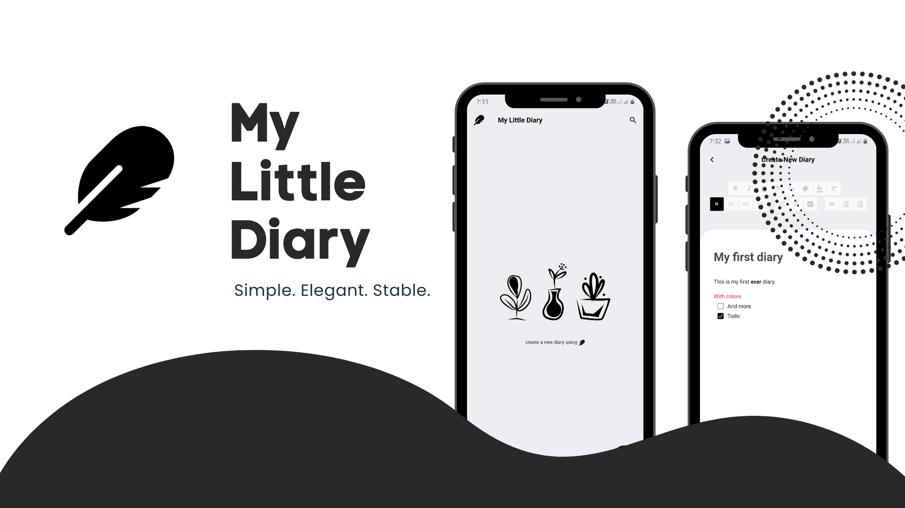
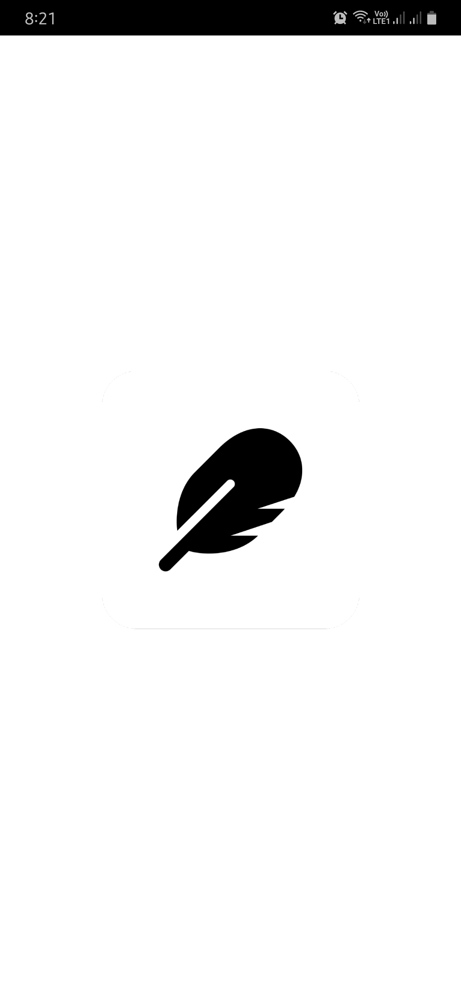
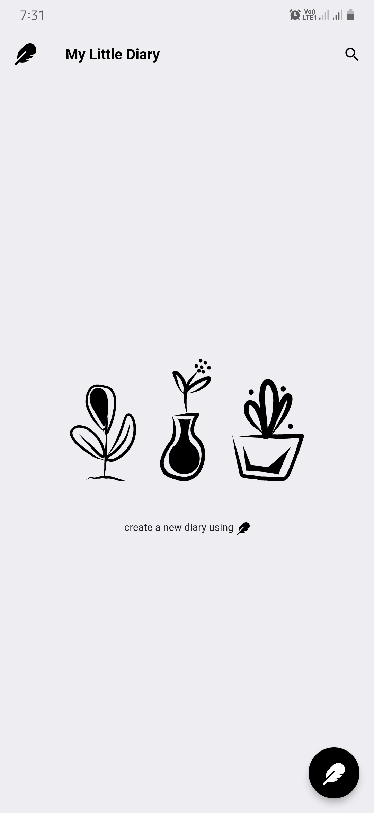
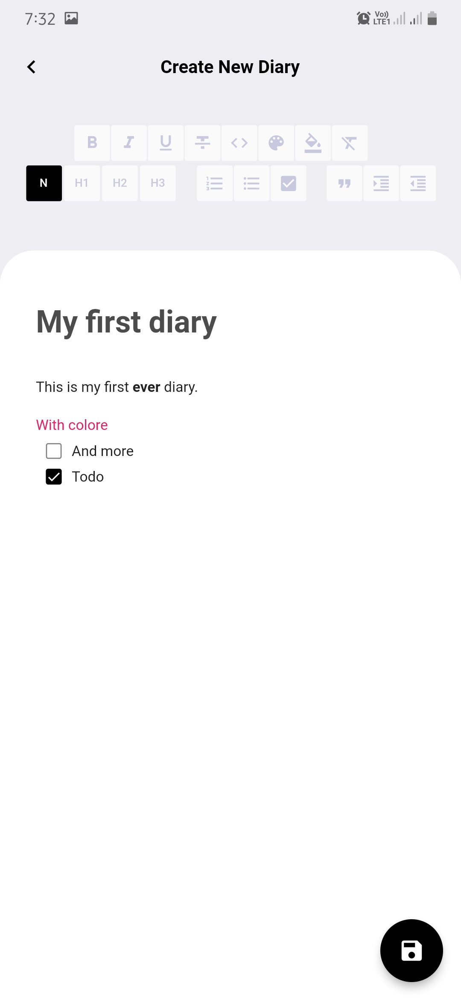
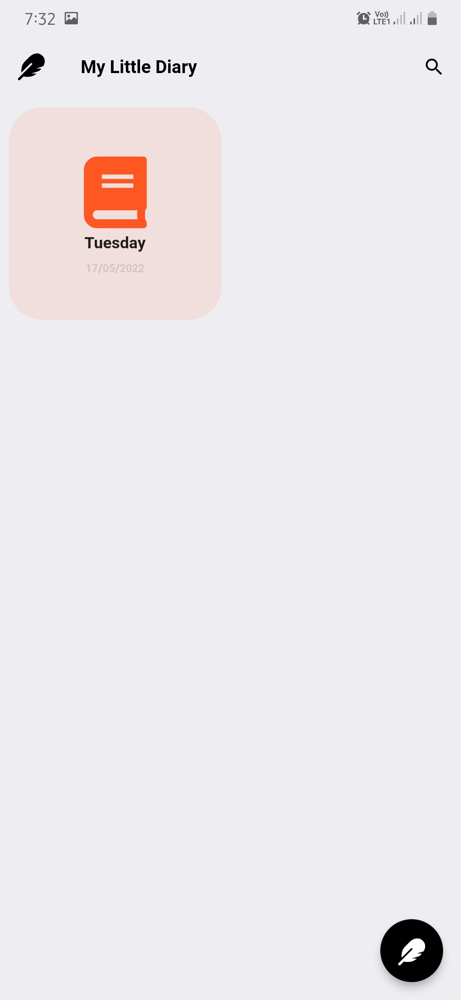
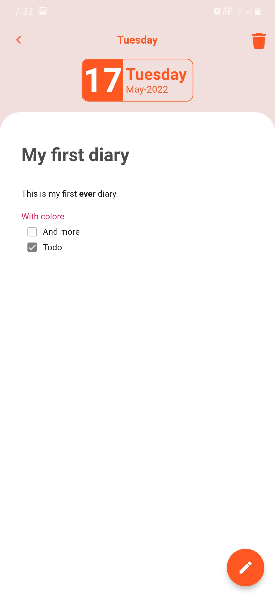
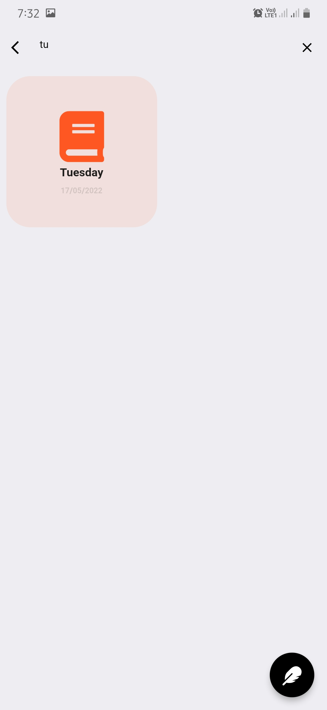

# My Little Diary

An Open-Source simple Diary App!

[](https://flutter.dev/)  

### Don't forget to :star: the repo

[](https://github.com//rijfas/my_little_diary)  

## Download

[](https://github.com/rijfas/my_little_diary/releases)
&nbsp;&nbsp;&nbsp;&nbsp;&nbsp;&nbsp;

## Features

- Completely offline
- Create diary
- Search based on title
- Colored diaries
- Rich text
- Todo list, code ...etc
- Stable and neat UI
- Cache support
- No Subscription
- No Ads

and much more...
Check it yourself :)

## Screenshots

 
 
 
 
 


## License

```
Copyright © 2021 Rijfas Usman

BlackHole is a free software licensed under GPL v3.0
It is distributed in the hope that it will be useful, but WITHOUT ANY WARRANTY;
without even the implied warranty of MERCHANTABILITY or FITNESS FOR A PARTICULAR PURPOSE.
```

```
Being Open Source doesn't mean you can just make a copy of the app and upload it on playstore or sell
a closed source copy of the same.
Read the following carefully:
1. Any copy of a software under GPL must be under same license. So you can't upload the app on a closed source
  app repository like PlayStore/AppStore without distributing the source code.
2. You can't sell any copied/modified version of the app under any "non-free" license.
   You must provide the copy with the original software or with instructions on how to obtain original software,
   should clearly state all changes, should clearly disclose full source code, should include same license
   and all copyrights should be retained.

In simple words, You can ONLY use the source code of this app for `Open Source` Project under `GPL v3.0` or later
with all your source code CLEARLY DISCLOSED on any code hosting platform like GitHub, with clear INSTRUCTIONS on
how to obtain the original software, should clearly STATE ALL CHANGES made and should RETAIN all copyrights.
Use of this software under any "non-free" license is NOT permitted.
```

See the [GNU General Public License](https://github.com/rijfas/my_little_diary/blob/main/LICENSE) for more details.

## Contribute

Contributions are welcome. Please read our [contributing guidelines](https://github.com/rijfas/my_little_diary/blob/main/CONTRIBUTING.md) before contributing.

## Facing any Issue?

Have a look at some [common Issues](https://github.com/rijfas/my_little_diary/wiki/Common-Issues) that you might face. If your problem is not there, feel free to open an Issue :)

## What's New

To read full changelog visit the [wiki page](https://github.com/rijfas/my_little_diary/wiki/Changelog)
